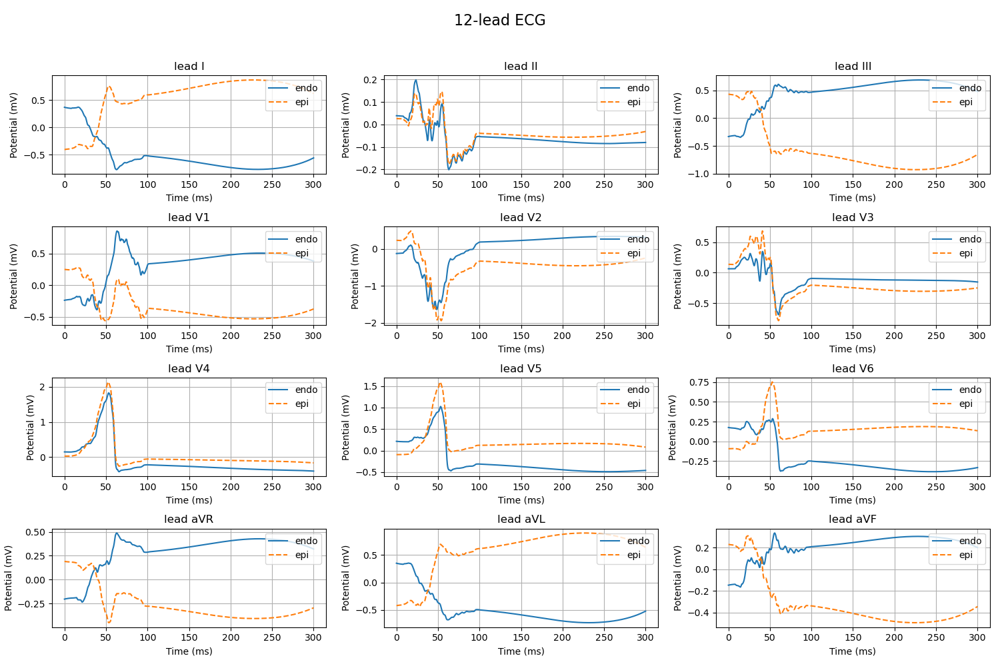
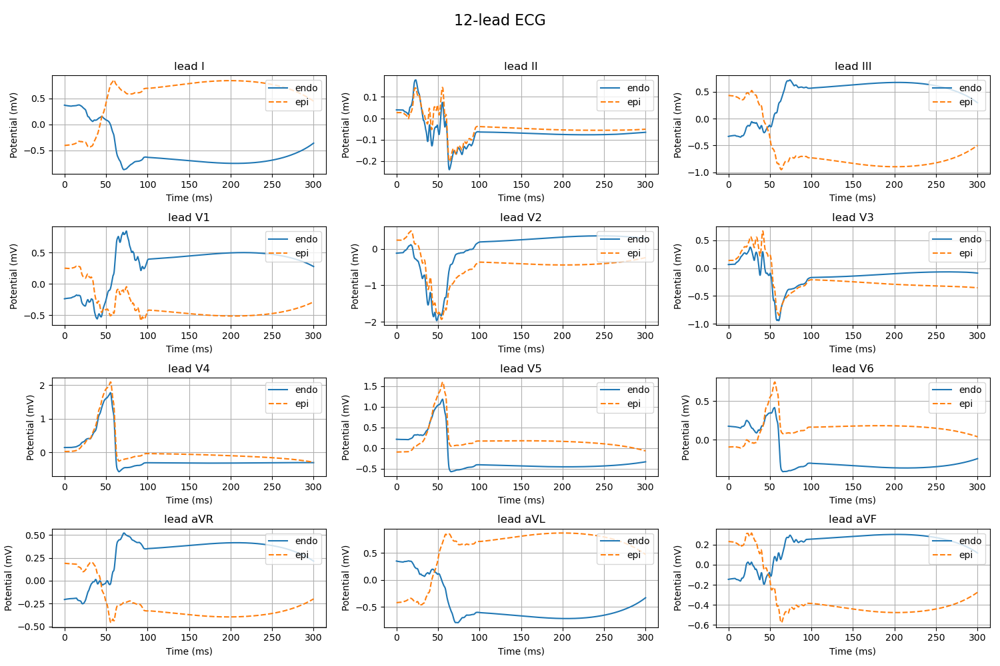
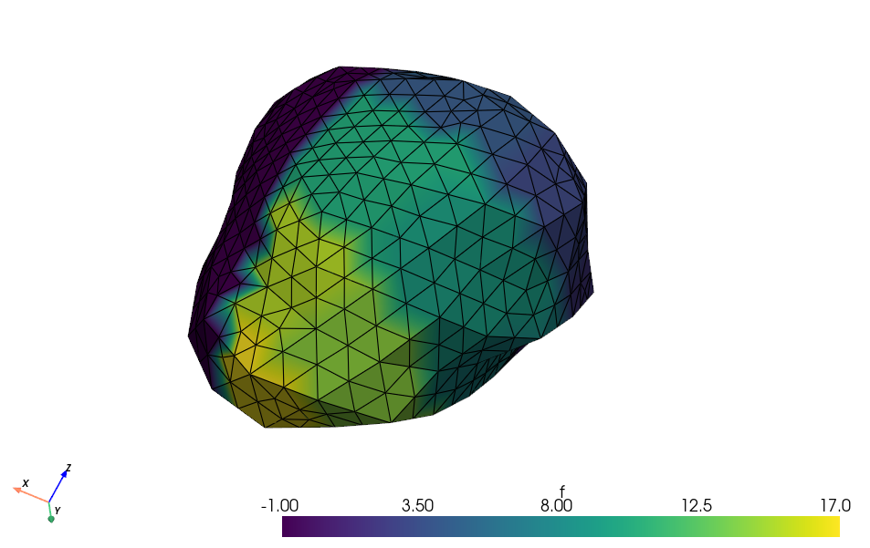
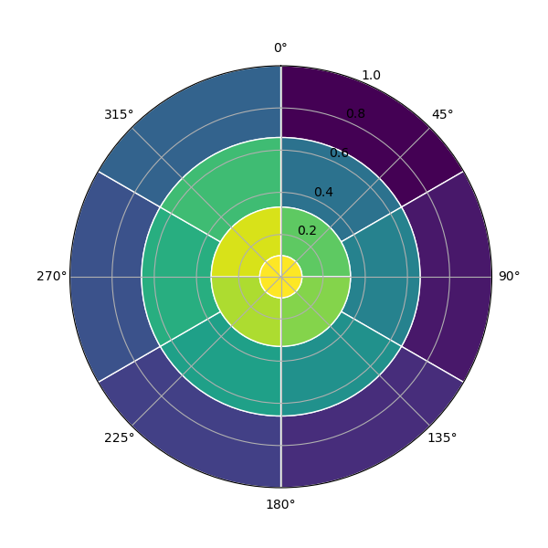

# 10.13 汇报

## 类似位置外膜和内膜缺血之间体表电压的差异

ECGsim软件与模拟实验都说明有影响

仅外膜 仅内膜

外膜+膜中间 内膜+膜中间

## 心室的划分

基于AHA17划分分割左心室

|环层|对应区域|段号范围|每环段数|
|--|--|--|--|
|基底环 (Basal)|二尖瓣环附近|1–6|6|
|中间环 (Mid)|心室中部|7–12|6 |
|心尖环 (Apical)|接近心尖|13–16|4|
|心尖顶 (Apex tip)|最尖端处|17|1|

分割图

圆环图

## 缺血数据集

计算多个时刻的成本很高
