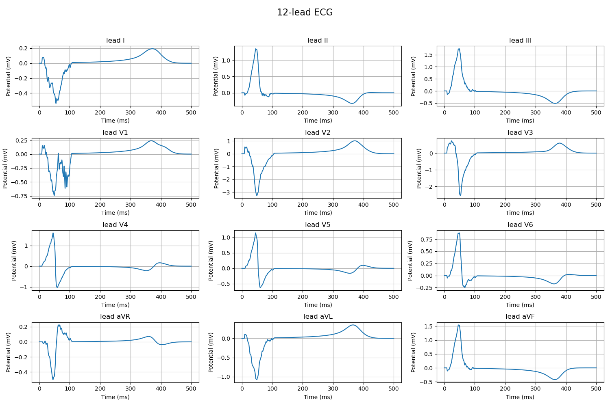
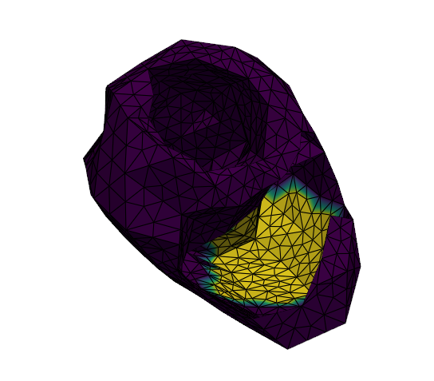
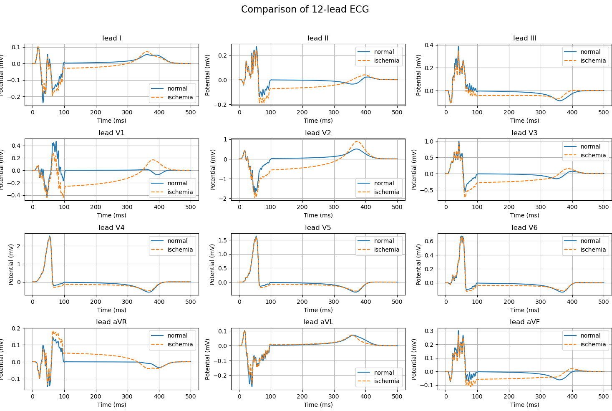

# 11.17

## 激活加密 V1波形

单点起源 12导联波形依旧有问题

多激活无法解决激活问题

推测有可能是几何问题 ECGsim也有抖动
参数突变？

## 时域加密测空间

timestep = 16
lc_inner = 4, 8, 16, 32
依旧不对

## apd90 作图

已添加作图功能

## v2-v6压低 内膜缺血

对应ST段下降

## 缺血导致的二次起搏，正常不会

改v_rest 无效
v接近0强制归0

成功修改：强制单调减
