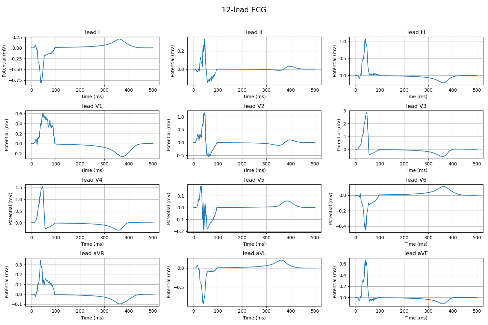
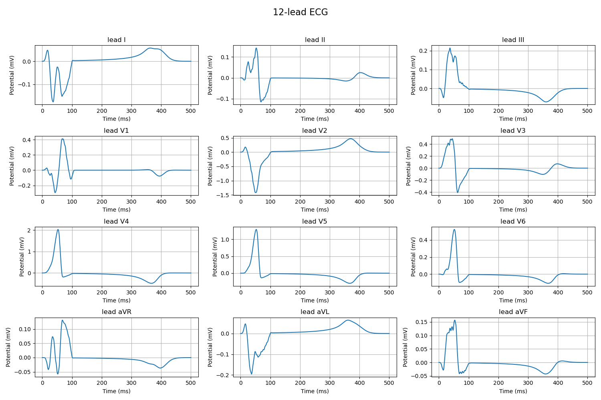
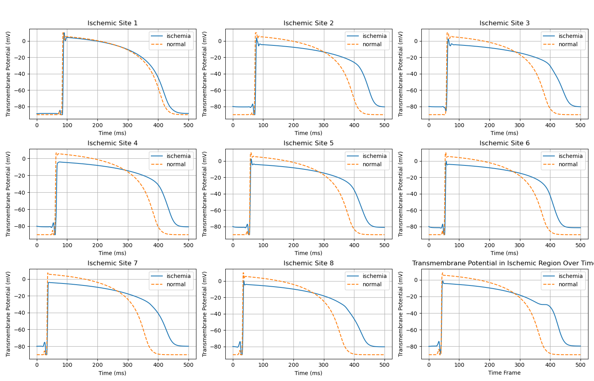
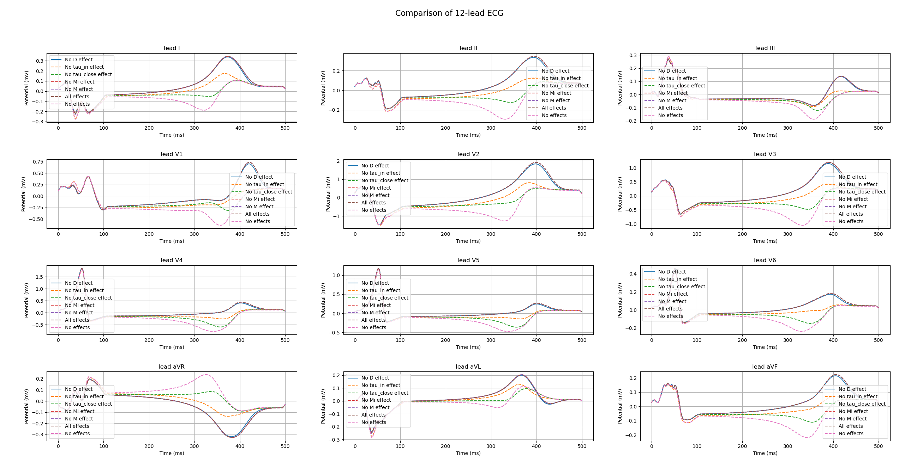

# 11.17

## V1波形

### 单点起源

### 多激活

### 推测有可能是几何问题 ECGsim也有抖动

参数突变？参数光滑化

### 直接对结果光滑

## 时域加密测空间收敛

timestep = 16
lc_inner = 4, 8, 16, 32
依旧不对

## apd90 作图

已添加作图功能

## v2-v6压低 内膜缺血

对应ST段下降

## 缺血导致的二次起搏，正常不会

改v_rest 无效
v接近0强制归0

成功修改：强制单调减

## 不同参数影响

### tau_in

### tau_close

### v_rest

### v_peak

### D

### M_i M_e
