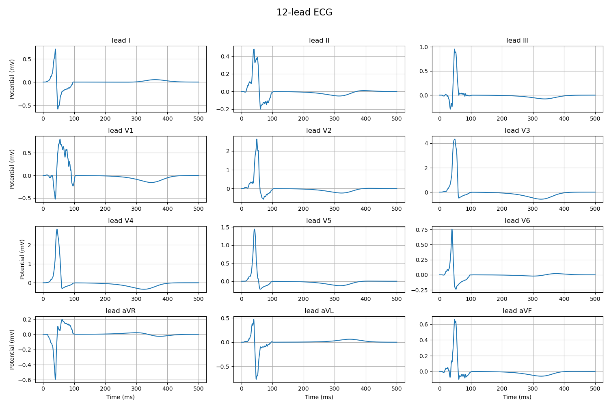
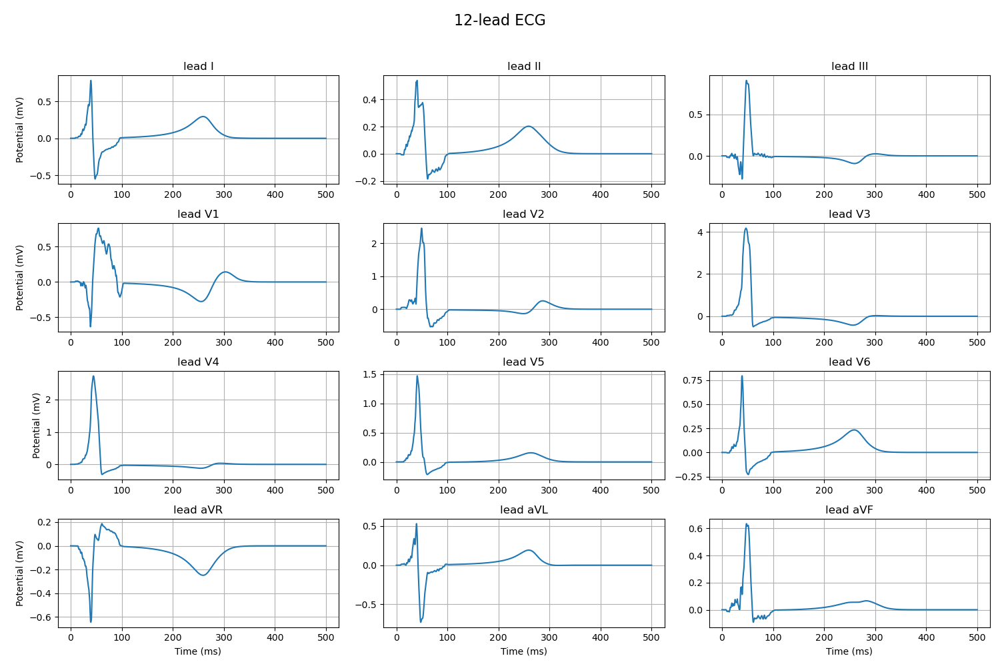
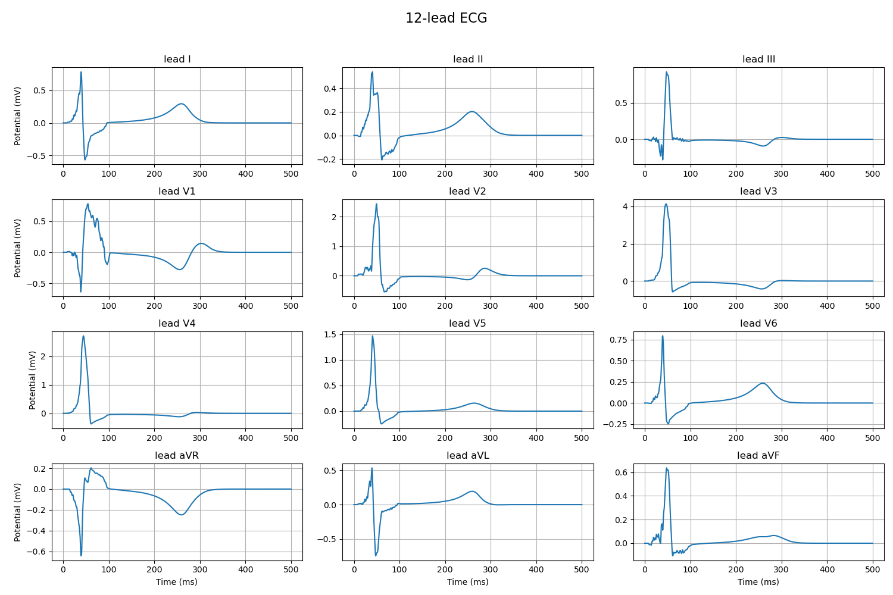

# 12.1

## 波形匹配

### 波形毛刺

#### 理想几何

#### 二次激活问题

替换跨膜电压

反应方程跨膜电压 -> 提取激活时刻 -> 套用ecgsim跨膜电压公式

ecgsim形式

不改变

激活后强制单调减

### QRS - T波间隙

tau_close集体减少

### 主波方向

tau_close修改 外膜内膜差值在5以内

## 机器学习识别算法

### 数据集制作

342缺血位置 3缺血半径 3缺血模式(内/外/穿透) 2缺血程度 = 6156条数据

## 水平集算法代码整理
