# 12.8

## D值变化的影响

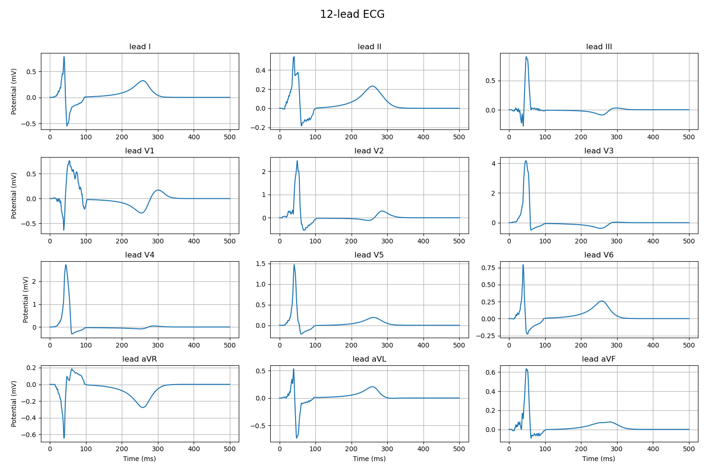

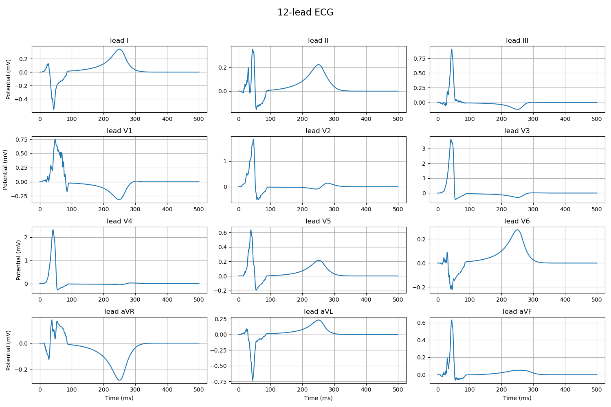
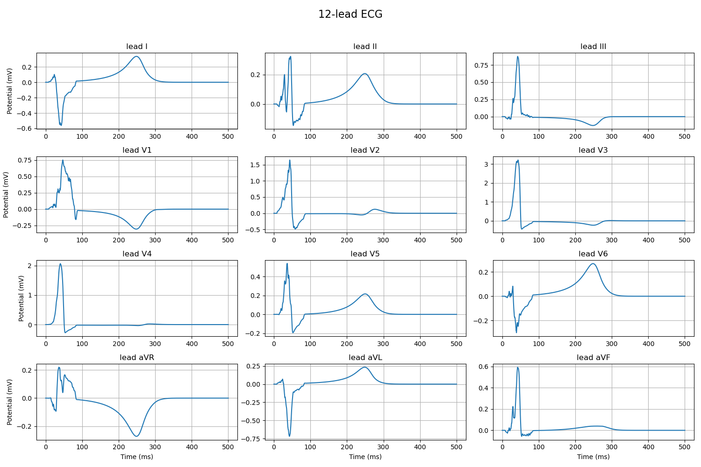
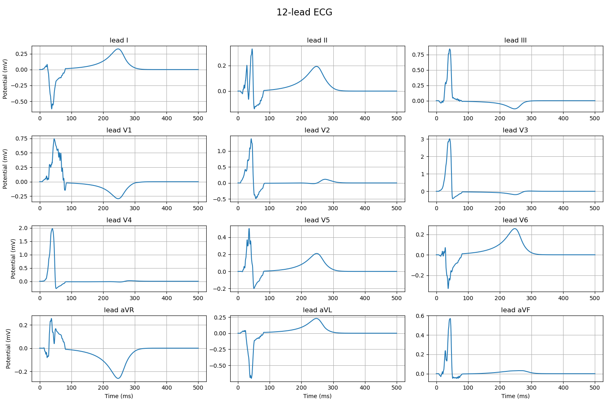
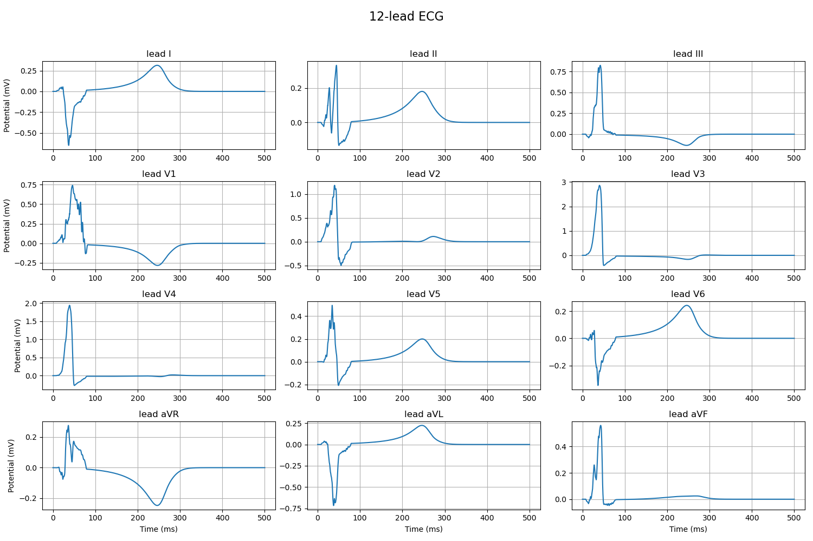
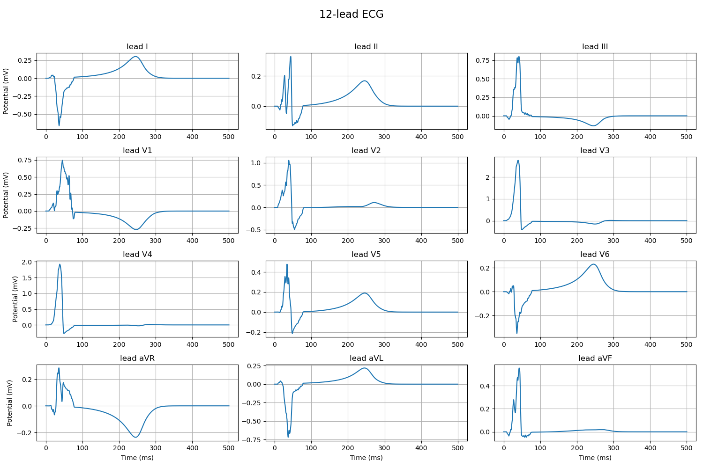
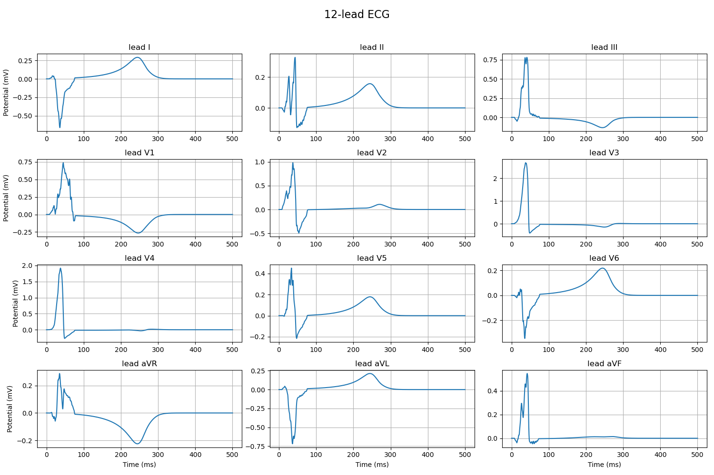
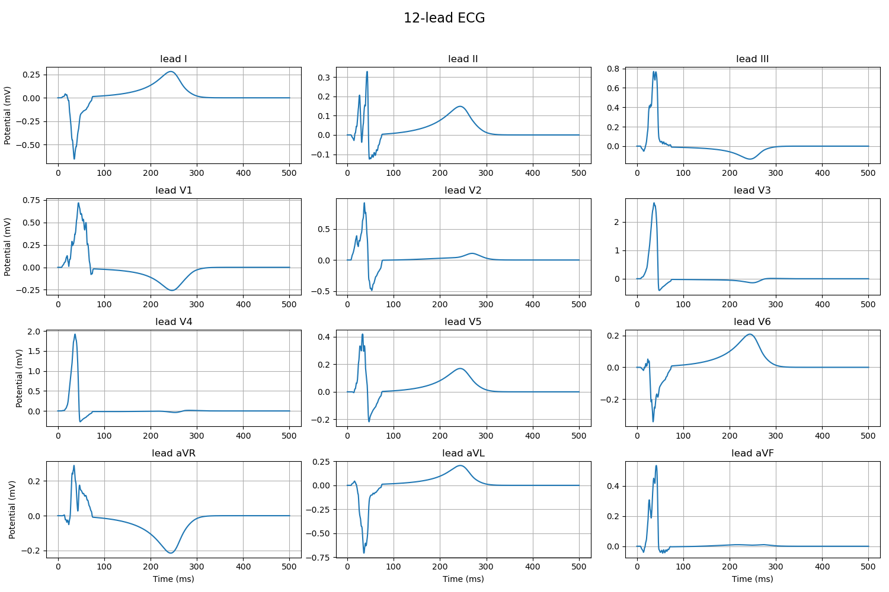
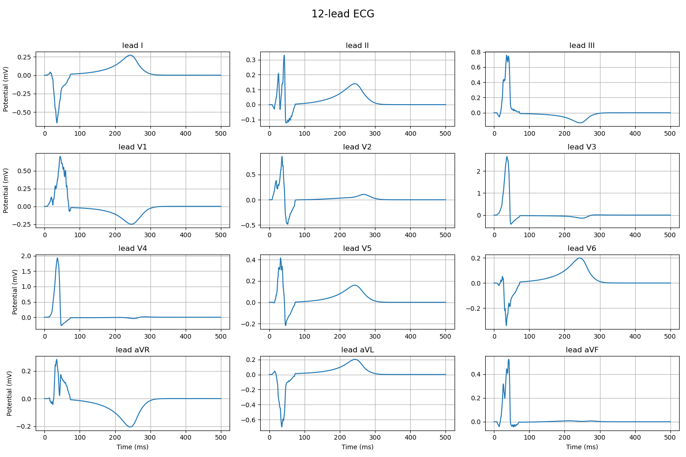

## 激活设置

初始激活时刻作图
室间隔激活

mode='IVS', threshold=60 get_IVS_region(threshold=10)

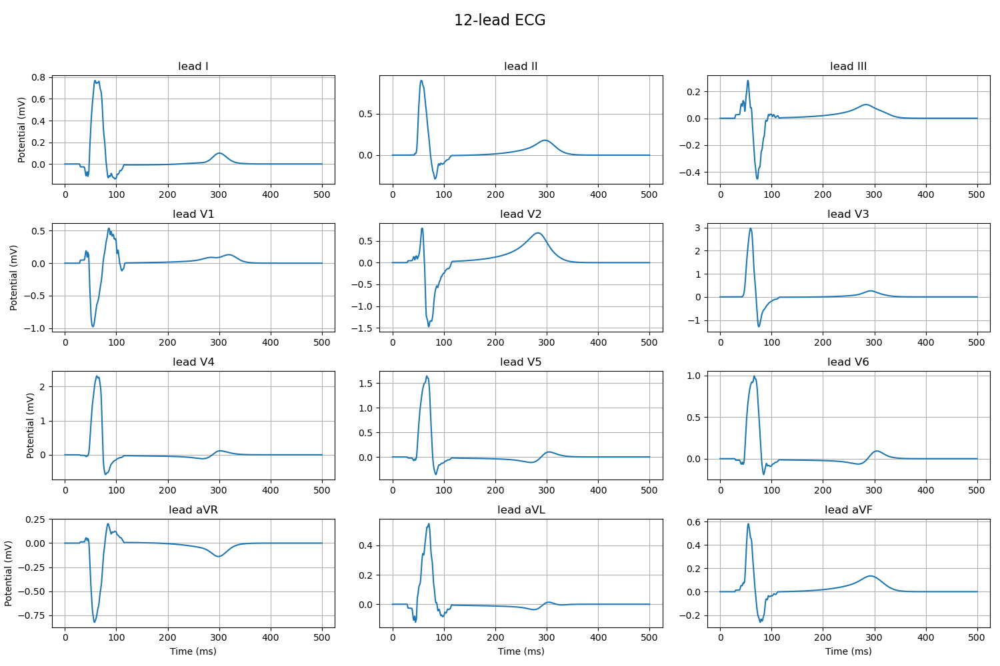

mode='IVS', threshold=60 get_IVS_region(threshold=10)

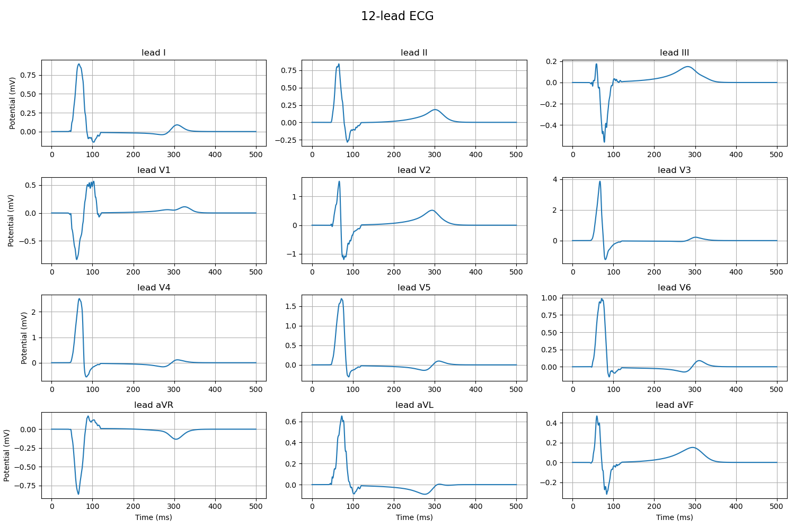

mode='IVS', threshold=60 get_IVS_region(threshold=9)

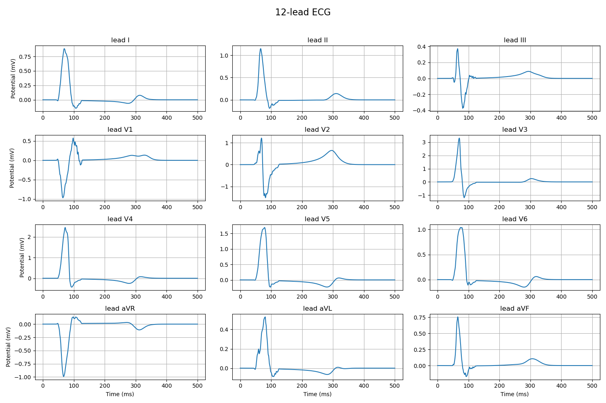

## 机器学习思路

### 大数据读入内存处理

数据需要提前reshuffle，不能按照文件名划分训练集和测试集

hdf5

只有部分模型支持增量训练
xgb原生接口
lgb原生接口
LogisticRegression改为SGDClassifier

### 数据集调整

- 包含非缺血数据
- 不同几何结构数据

### 输入调整

- V1-V6 6*500
- 64导 64*500
- 归一化

### 算法选择

- 其他机器学习算法
- 深度学习算法

### 输出观察

错误情形的观察
